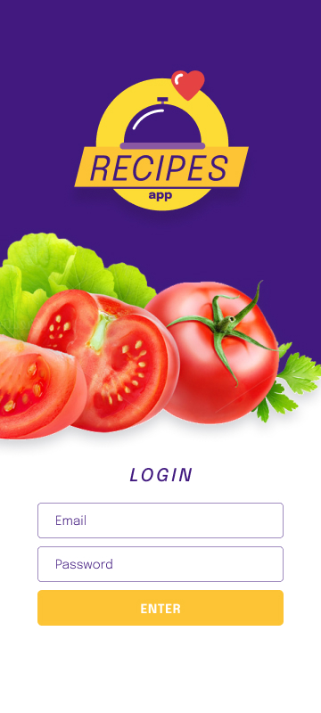

#

(https://recipes-app-beta-jet.vercel.app/ "Recipes-App")
Uma aplicacao de receitas para o seu dia a dia.

##Como instalar?
Faça o clone deste repositório com <code>git clone git@github.com:Jeffo182/recipes-app.git</code>

Instale as dependências com <code>nom install</code>

Rode o projeto com <code>npm start</code>
